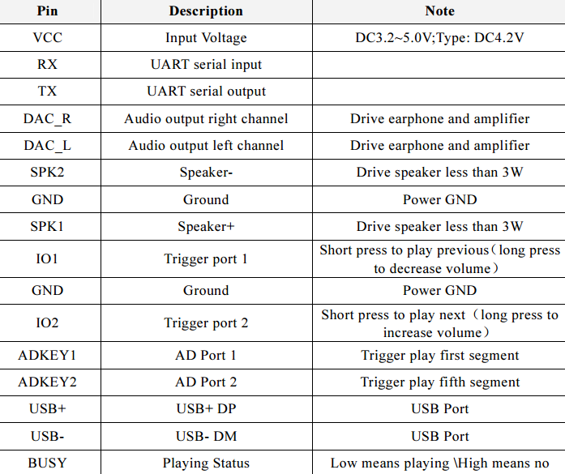

# DFPlayer Example

The DFPlayer module ([DF Player SKU:DFR2099](https://wiki.dfrobot.com/DFPlayer_Mini_SKU_DFR0299)
is a mini MP3 player for Arduino.

This folder is for test code and examples.

## Pinout

## Pin Descriptions

